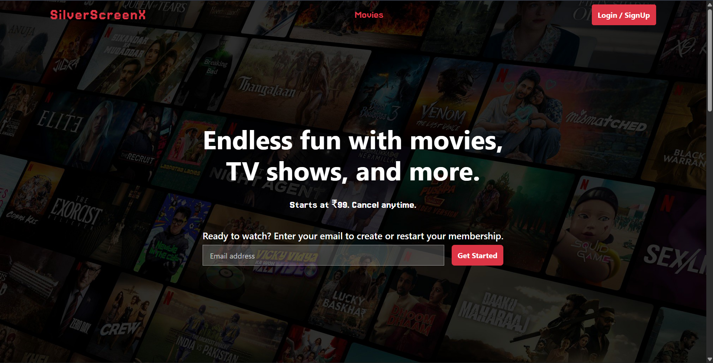
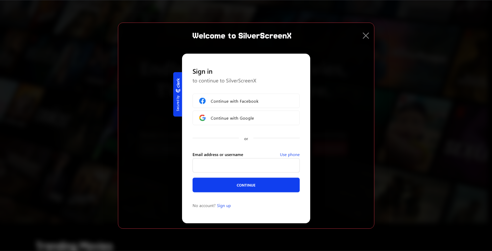
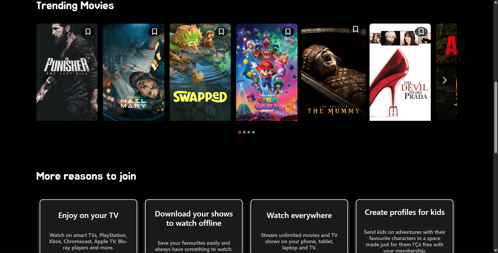
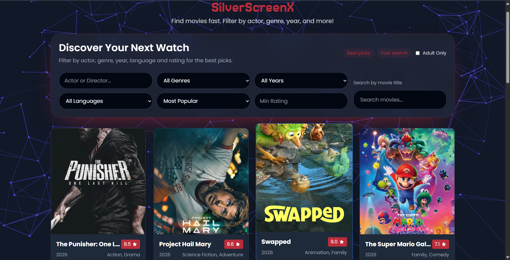
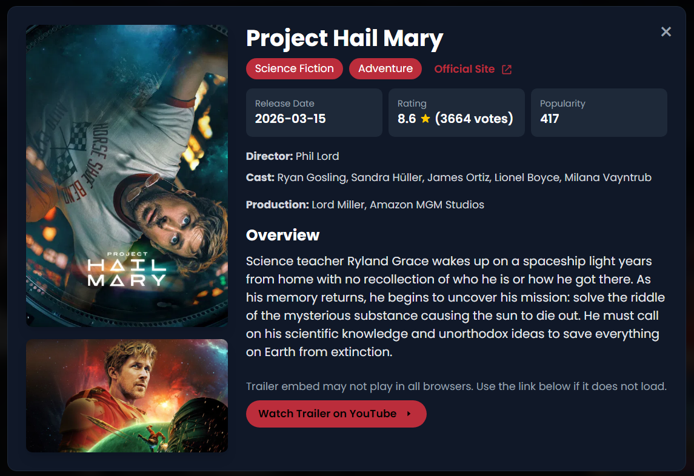
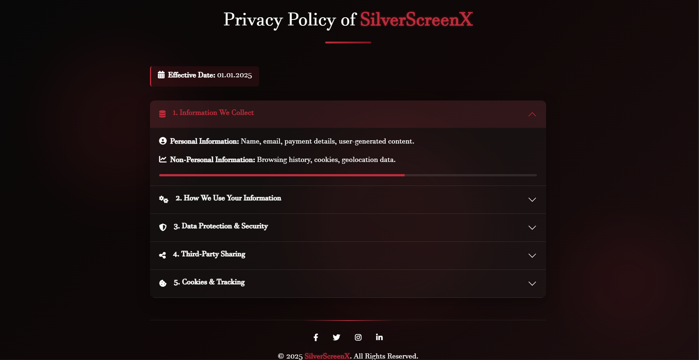
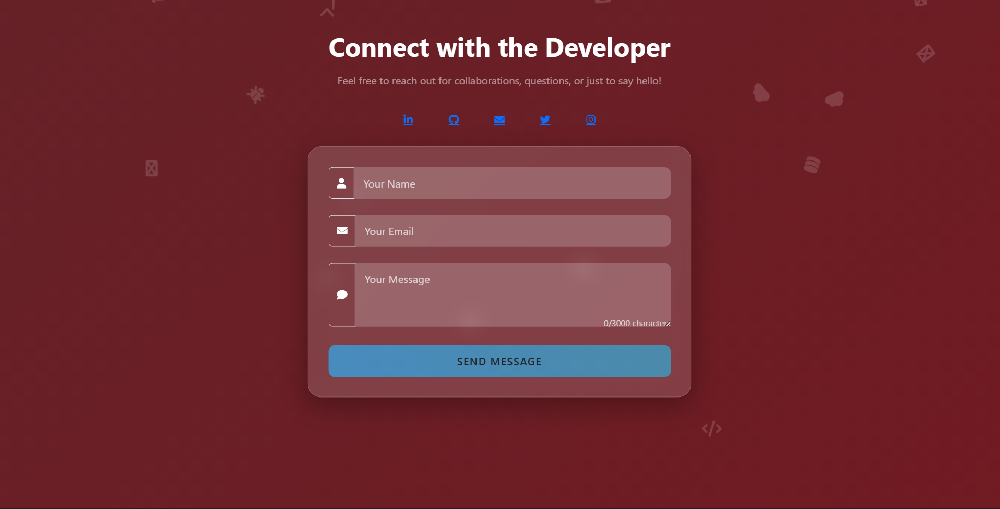

# SilverScreenX

SilverScreenX is a modern, responsive movie discovery web application. The project delivers a streaming-style experience with a trending movie carousel, advanced search and filter controls, a movie detail overlay, a contact page, and a privacy policy page.

---

## ✨ Features

- **Trending Movies Carousel:** Browse popular movies using TMDb API data.
- **Advanced Search & Filters:** Filter movies by title, genre, year, language, rating, and adult content.
- **Movie Detail Overlay:** Click a movie to see full details with genres, rating, runtime, and overview.
- **Responsive UI:** Mobile-friendly layout with desktop/tablet support.
- **Modern Brand Theme:** SilverScreenX red theme with custom styling and glassmorphism cards.
- **Contact Form:** Contact page with email submission support via backend.
- **Privacy Page:** Custom privacy policy with animated visuals.
- **Smooth Animations:** Animated elements using Vanta.js, Animate.css, and scroll effects.
- **Carousel UI:** Splide.js movie carousel for trending content.
- **Clerk Authentication:** Login modal powered by Clerk for signup/signin flow.
- **Error Handling:** Graceful fail states when API data cannot be loaded.

---

## 📁 Repository Structure

```
SilverscreenX/
├── Frontend/
│   ├── javascript/
│   │   ├── index.js
│   │   ├── movie.js
│   │   ├── privacy.js
│   │   └── connect.js
│   ├── page/
│   │   ├── index.html
│   │   ├── movie.html
│   │   ├── connect.html
│   │   └── privacy.html
│   └── style/
│       ├── index.css
│       ├── movie.css
│       └── privacy.css
├── contact/
│   └── serverautoreply/
│       ├── package.json
│       ├── package-lock.json
│       └── server.js
├── assests/
│   ├── child.png
│   ├── Download.png
│   ├── IN-en-20250224-TRIFECTA-perspective_3a9c67b5-1d1d-49be-8499-d179f6389935_large.jpg
│   ├── tlescope.png
│   └── tv.png
├── package.json
├── package-lock.json
├── README.md
├── .gitignore
└── screenshot files
```

---

## 🚀 Getting Started

### Prerequisites

- Modern web browser (Chrome, Firefox, Edge, etc.)
- Internet connection to fetch TMDb data and remote CDNs

### Run the frontend locally

1. Clone the repository:
    ```sh
    git clone https://github.com/your-username/SilverScreenX.git
    cd SilverScreenX
    ```

2. Open the app in browser:
    - Open `Frontend/page/index.html` directly
    - Or use a local server such as Live Server in VS Code

3. Visit the pages:
    - `Frontend/page/index.html` — Home page
    - `Frontend/page/movie.html` — Movie explorer
    - `Frontend/page/connect.html` — Contact page
    - `Frontend/page/privacy.html` — Privacy policy

---

## 🌐 Main Pages

- **Home:** `Frontend/page/index.html`
- **Movie Explorer:** `Frontend/page/movie.html`
- **Contact:** `Frontend/page/connect.html`
- **Privacy Policy:** `Frontend/page/privacy.html`

---

## 🛠️ Technologies Used

- HTML5, CSS3, JavaScript (ES6+)
- Bootstrap 5 for layout and components
- Tailwind CSS via CDN for utility styling
- TMDb API for movie data
- Splide.js carousel
- Vanta.js animated backgrounds
- Animate.css for motion effects
- jQuery for FAQ toggles and page interactions
- Node.js + Express backend for contact form email sending

---

## 🔧 Notes

- The frontend uses `Frontend/javascript/index.js` and `Frontend/javascript/movie.js` for movie API logic and page behavior.
- Theme styling is spread across `Frontend/style/index.css`, `Frontend/style/movie.css`, and `Frontend/style/privacy.css`.
- The homepage and movie page use the brand red accent `#BB2D3B`.
- `Frontend/javascript/index.js` also handles Clerk login and page initialization.
- `contact/serverautoreply/server.js` supports email sending via Nodemailer when configured with environment variables.

---

## ⚠️ API Keys & Secrets

- The TMDb API key is currently stored in frontend JS for demo purposes.
- The Clerk publishable key is safe for frontend use, but private keys should never be exposed in browser code.
- For production, move sensitive credentials to a backend server and use environment variables.

---

## 🚀 Backend Contact Server

To run the contact form backend:

```sh
cd contact/serverautoreply
npm install
npm start
```

Then set environment variables for email delivery:

```env
EMAIL_USER=youremail@example.com
EMAIL_PASS=your-email-password
PORT=3001
```

---

## 📸 Screenshots









---

## 📬 Contact

For questions or feedback, open `Frontend/page/connect.html` or email itzrishi102@gmail.com.

---

**Enjoy exploring movies with SilverScreenX!**
